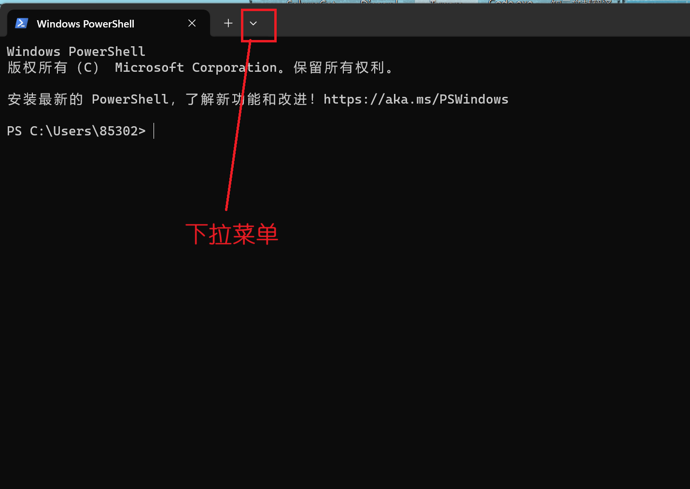
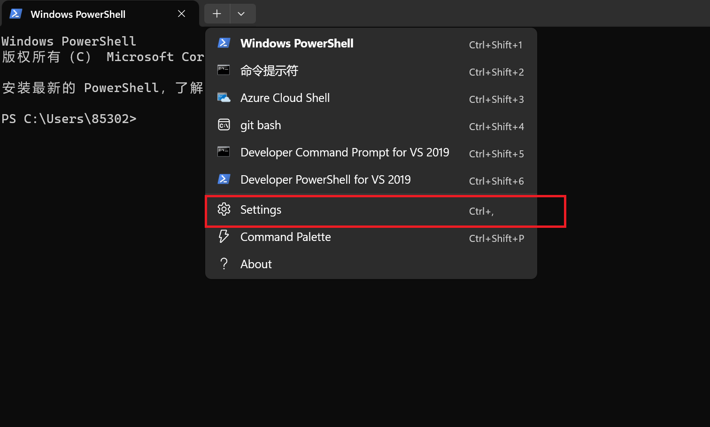
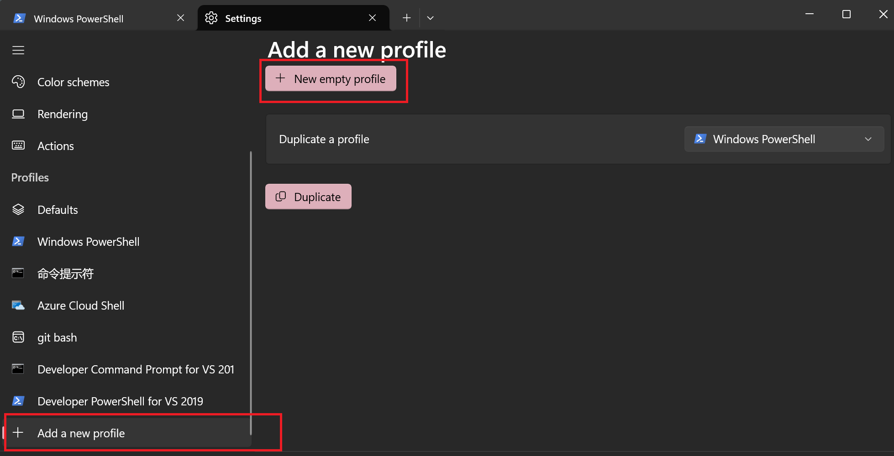
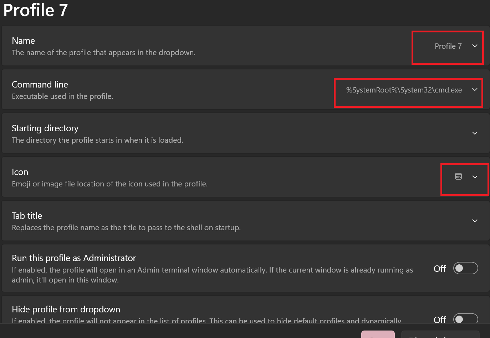

> 本教程基于windows操作系统，如果需要mac以及Linux教程请后续联系作者

# 本教程内容：本地编辑网站内容+deploy至GitHub

## 1 搭建Hexo环境

### 1.1 搭建前的准备

#### 1.1.1 安装Node.js

> 下载地址： http://nodejs.cn/download/

选择windows安装包.msi安装


运行安装包，我们默认选择c盘


在这里选择Add to PATH然后点Next继续就行了


### 1.1.2 安装Git

> 下载地址：https://git-scm.com/


下载最新版本


运行安装包，选择合适的安装位置，然后点Next

后面的安装步骤全部只要点Next就行了，不需要我们多余配置

我们安装完Git后，在桌面右键会有Git Bash Here，我们直接点开


**注意！**window11不再能直接打开`Git bash here` 需要手动把git bash 添加到windows terminal中

下面是操作流程：

1. 打开terminal，看到这个下拉菜单了嘛，点他，戳戳设置






2. 添加新的配置文件



3. 填写相关信息：

   名称`git bash`     

   路径： `你的git路径 `     

   图标：可有可无  



关键就是要找到你电脑上Git Bash的位置，常常在：`Git\bin\bash.exe`,而图标常位于`Git\mingw64\share\git`下的`git-for-windows.ico`文件

4. 保存之后重新打开就可以在下拉菜单中看见Git bash了

完成上述步骤后我们要进行一下检验，新建一个本地文件夹，在文件夹内右键打开终端，切换到git bash

看看node.js以及npm包管理工具是否可用

```bash
 node -v
 npm -v
```

在Git bash里执行

```bash
 npm install -g cnpm --registry=https://registry.npm.taobao.org
```

这个cnpm就是防止在没有魔法上网时下载不了包所引入的淘宝国内源

在可以魔法上网时，今后的所有`cnpm`指令都可以换成`npm`

### 1.2 正式搭建

在你将来准备用于本地编辑网页的文件夹内打开Git bash

安装Hexo

```bash
cnpm install hexo-cli -g
```

安装完毕后可以检测一下版本号

~~~
hexo -v
~~~

然后还是在你的文件夹内，进行

```bash
hexo init
```

如果没有魔法上网到`Install dependencies`的时候你可能会卡住，

我们只需要在这里的时候结束命令，按`Ctrl + c`就可以结束命令

然后再输入

```bash
cnpm install
```

这样国内镜像就会帮你补全初始化的内容

接着前往我们的库[qiushibio/webcode (github.com)](https://github.com/qiushibio/webcode)

把里面的文件下载下来，覆盖你本地的文件，这样可以获取网站最新更新进度的文件了

## 2 编辑内容

插入图片：typora用户请移步此处查看[typora + hexo博客中插入图片 ](https://yinyoupoet.github.io/2019/09/03/hexo博客中插入图片/)

主题排版：详情可以查看本站点使用的安知鱼主题的用户手册，在此不多赘述，主要就是修改yml文件啦

新建文本内容：本质就是新建`.md`文件

在你的本地文件夹内的Git bash中

~~~bash
hexo new your_page_name
~~~

然后你就会在`source\_posts`里面找到你新建的`.md`文件然后就可以快乐编辑了，关于文件的下载功能以及其他功能后续会陆续添加在教程中，如果愿意的话也可以自己去

[文档 | Hexo](https://hexo.io/zh-cn/docs/)

以及我们使用的主题的用户手册：[安知鱼主题官方文档 ](https://docs.anheyu.com/)

进行学习

## 3 上传+部署


我们需要创建一个git秘钥（为了安全起见，大家自己建自己电脑的密钥吧，就不把密钥放在这个地方了）

还是在老地方，在你的文件夹内打开Git bash

```bash
ssh-keygen -t rsa -C "qiushibio@outlook.com"
```

后面不管出现什么信息你就都直接回车就好了

然后执行

```bash
cat ~/.ssh/id_rsa.pub
```

把密钥调出来，复制一下

然后登录我们的公共GitHub账号

然后点击头像，点击Settings

然后在左边的菜单里面有SSH密钥登录设置

我们打开后点New SSH Key

然后粘贴你刚刚复制的东西


添加完成后，回到Git bash

执行：

```bash
ssh -T git@github.com
```

初次链接会提示这个

```bash
Are you sure you want to continue connecting (yes/no/[fingerprint])? 
```

**输入yes然后后回车**

接下来是设置用户名信息：

```bash
git config --global user.name "qiushibio"
git config --global user.email "qiushibio@outlook.com"
```

最后安装上传插件：

```bash
cnpm install hexo-deployer-git --save
```

然后先预览一下你目前的网站有无明显bug与缺陷

```bash
hexo cl && hexo g && hexo s
```

没有的话就

```bas
hexo cl && hexo g && hexo d
```

网站html文件上传至`qiushibio.github.io`后不要忘记把你本次修改的三个部分也上传到`webcode`中哦

如果你安装了什么新的插件，记得在`webcode`里面说明一下捏~

